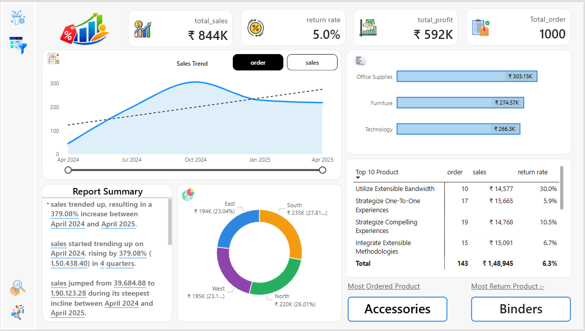
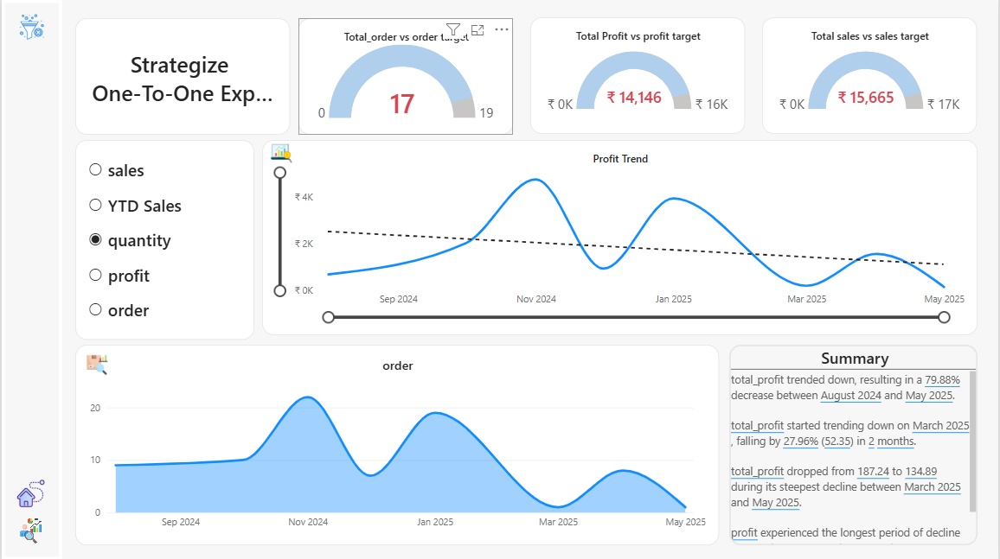
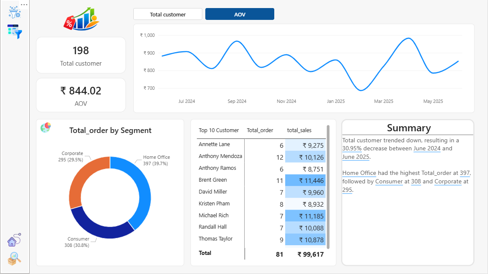

# 📊 Sales & Customer Performance Dashboard

## 🚀 Project Overview
This is an interactive Power BI dashboard designed to analyze **Sales Performance, Customer Behavior, and Product Insights**.  
The project uses **data modeling (Star Schema), DAX measures, and time intelligence** to generate meaningful business insights.

---

## 📁 Dataset
The dataset includes:
- Sales Data
- Customer Data
- Product Data
- Returns Data
- Region Data

---

## 📊 Key KPIs
- 💰 Total Sales: ₹844K  
- 📦 Total Orders: 1000  
- 🔁 Return Rate: 5%  
- 🧾 AOV (Average Order Value)  

---

## 📈 Dashboard Pages

### 🟢 Home Dashboard

---

### 🔵 Product Analysis

---

### 🟣 Customer Analysis

---

## 🔍 Key Insights
- 📈 Sales increased significantly over time  
- 🔁 Certain products show higher return rates  
- 👥 Customer segments have different purchasing patterns  
- 💡 AOV helps identify high-value customers  

---

## 🛠 Tools & Technologies
- Power BI  
- DAX (Data Analysis Expressions)  
- Data Modeling (Star Schema)  

---

## 💡 Features
- Interactive filters & slicers  
- Drillthrough pages  
- KPI cards & dynamic visuals  
- Time Intelligence (YOY, MOM, YTD)  

---

## 📂 Project Structure
